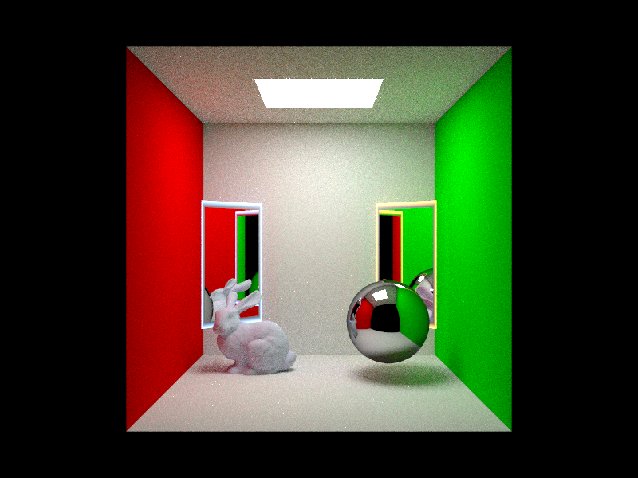

# CS 248A Assignments Repository

This repository contains the code and resources for the Ben O'Keefe final CS248a assignment. The final project is an implementation of portals as a part of our ray-tracing renderer. These behave similarly to the portal game, but any number of portals can be paired together.

